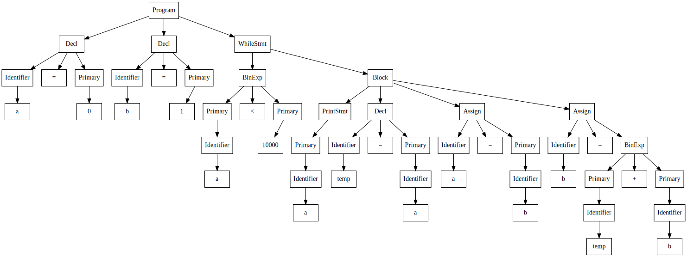

# Overview
This is a parser and interpreter for a simple programming language written for educational purposes. The goal was to keep things as minimal as possible to allow for quick prototyping. 

The combination of Python + OMeta is very expressive, and was a great fit for this project. The total code is around 200 lines (40 of OMeta).

# Run it
## Interpreter
`pip install parsley`

`python sol.py [file]`

Running with no file will drop into REPL mode.

## AST Visualizer
[Download Graphviz](https://www.graphviz.org/download/)

Get the Python Graphviz interface:

`pip install graphviz`

Run:

`python visualize.py [file]`

# References
## [OMeta](https://en.wikipedia.org/wiki/OMeta)
This is the meta-language used for the parser. It's basically a souped-up [PEG](https://en.wikipedia.org/wiki/Parsing_expression_grammar). Alessandro Warth's [thesis](http://www.vpri.org/pdf/tr2008003_experimenting.pdf) is probably the best place to read about it.

## [Parsley](https://github.com/pyga/parsley)
An implementation of OMeta in Python.

## [Crafting Interpreters](http://craftinginterpreters.com/)
Excellent introductory book on implementing interpreters. This language and interpreter are strongly inspired by jlox.
